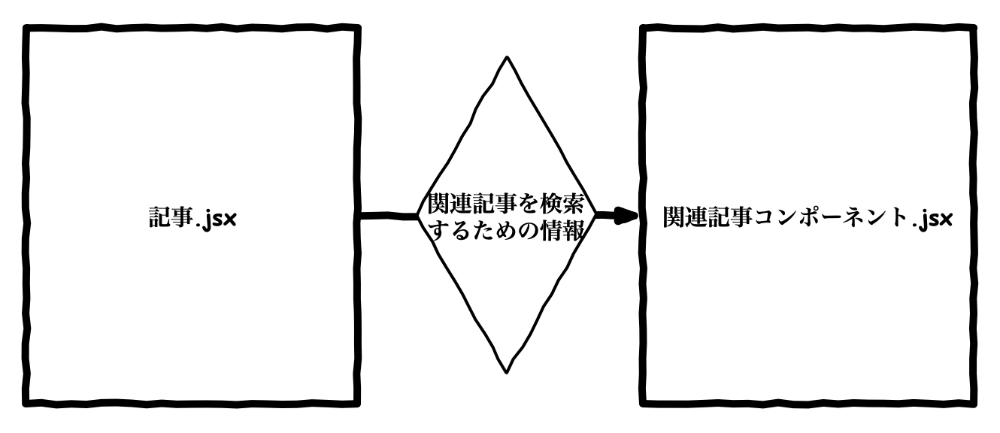

Gatsby で作成したブログに関連記事を表示させてみたので、その話です。

## 関連記事をどのような条件で表示させるのか

さて、関連記事を表示させる際にまず考えないといけないのは、「どのような条件で関連記事として表示させるのか」を考えないといけないと思います。  
記事自体に関連記事の情報を持たせる方法、記事の内容から関連記事を取得する方法など色々とあると思います。

今回はシンプルに、**「記事に付いているタグとカテゴリーが同じもの」**を関連記事として表示させようと思います。

なお、この記事ではカテゴリーとタグはすでに実装済みとして話を進めていきます。

## 関連記事を表示させるコンポーネントを作る

さて、それでは関連記事を表示させるためのコンポーネントを作っていきます。



関連記事コンポーネントは上記イメージのような感じですね。  
記事から関連記事コンポーネントへ関連記事を検索するための情報を渡して、関連記事コンポーネントで親記事に関連する記事を検索して表示する感じです。

[タグ一覧を作ったとき](gatsby-js-tags/)と同じように、関連記事コンポーネントでは StaticQuery を使って作ります。

ちなみに、Gatsby の GraphQL では `filter` というクエリを使ってフィルタリングをできます。

```json
{
  allMarkdownRemark(
    filter: { frontmatter: { category: { eq: "Tech" } } }
  ){
    edges {
      node {
        frontmatter {
          title
          cover
          date
          category
          tags
        }
        fields {
          slug
          date
        }
      }
    }
  }
}
```

試しに、開発環境の[localhost:8000/___graphql](http://localhost:8000/___graphql)で上記クエリを実行してみると、  
記事カテゴリーが Tech の記事データのみを取得できます。

上記クエリを利用したコンポーネントを作れば簡単に関連記事コンポーネントが作れると思いますよね。  
**ただ、上記を応用した感じで作ろうとすると上手くいきません。**

試しに以下の関連記事コンポーネントを試してみてください。**（エラーになります）**  
下記では、親記事の情報を `post` に格納してコンポーネントに渡してあります。

```javascript
import React from "react";
import { StaticQuery, graphql } from "gatsby";
import { Link } from "gatsby";

const RelatedPosts = ({ post }) => (
  <StaticQuery
    query={graphql`
      query {
        allMarkdownRemark(
          filter: { frontmatter: { category: { eq: ${post.category} } } }
        ){
          edges {
            node {
              frontmatter {
                title
                cover
                date
                category
                tags
              }
              fields {
                slug
                date
              }
            }
          }
        }
      }
    `}
    render={data => {
      const relatedPosts = data.allMarkdownRemark.edges

      if (!relatedPosts) { return null; }
      return (
        <div className="related-posts">
          <p className="related-posts-title">関連記事</p>
            {relatedPosts.map(relatedPost => (
              <div className="related-post">
                <Link to={relatedPost.node.fields.slug} key={relatedPost.node.frontmatter.title}>
                  <p>{relatedPost.node.frontmatter.title}</p>
                </Link>
              </div>
            ))}
        </div>
      );
    }}
  />
);

export default RelatedPosts;
```

以下のようなエラーになります。

```log
Error: BabelPluginRemoveGraphQL: String interpolations are not allowed in graphql fragments. Included fragments should be referenced as `...MyModule_foo`.
```

**なぜなら StaticQuery はコンパイルされ、テンプレートリテラルでの文字列補間をサポートしないため、「Static(静的）」と呼ばれます。**   
これを行おうとすると、ビルド時に上記エラーが表示されるというわけです。

そのため、**全記事のデータを StaticQuery で取得してから関連記事をフィルタリングするコンポーネントを作る必要があります。**

以下にサンプルを書いてみました。  
例によって、呼び出し元から親記事の情報を変数 `post` でコンポーネントに渡してあげています。

```javascript
import React from "react";
import { StaticQuery, graphql } from "gatsby";
import { Link } from "gatsby";

const RelatedPosts = ({ post }) => (
  <StaticQuery
    query={graphql`
      query {
        allMarkdownRemark(
          sort: { fields: [fields___date], order: DESC }
        ){
          edges {
            node {
              frontmatter {
                title
                cover
                date
                category
                tags
              }
              fields {
                slug
                date
              }
            }
          }
        }
      }
    `}
    render={data => {
      const relatedPosts = data.allMarkdownRemark.edges.filter(
        edge => 
        {
          if(edge.node.frontmatter.title === post.title){
            return false
          }
          if(edge.node.frontmatter.category !== post.category){
            return false
          }
          for (let i = 0; i < edge.node.frontmatter.tags.length; i++) {
            if (edge.node.frontmatter.tags[i] !== post.tags[i]){
              return false
            }
            else{
              return true
            }
          }
        }
      );
      if (!relatedPosts) { return null; }
      return (
        <div className="related-posts">
          <p className="related-posts-title">関連記事</p>
            {relatedPosts.map(relatedPost => (
              <div className="related-post">
                <Link to={relatedPost.node.fields.slug} key={relatedPost.node.frontmatter.title}>
                  <p>{relatedPost.node.frontmatter.title}</p>
                </Link>
              </div>
            ))}
        </div>
      );
    }}
  />
);

export default RelatedPosts;

```

上記の関連記事コンポーネントは、全記事を取得してから JavaScript の filter 関数でフィルタリングするように作ってみました。

こちらの関連記事コンポーネントは上手く表示できました。

## 終わりに

今回は関連記事の実装ついでに StaticQuery でのエラーの解説を書いてみましたが、  
実は自分も StaticQuery のクエリで関連記事をフィルタリングしようとしてエラーになってしまっていました。

似たようなことで悩んでいるかたの助けになれば幸いです。

## 参考

[Gatsby公式 StaticQuery](https://www.gatsbyjs.org/docs/static-query/)