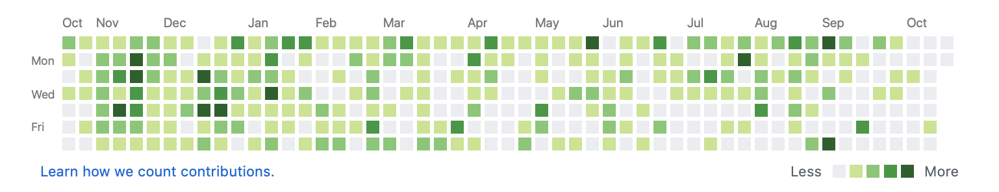

## そもそも GitHub の芝生とは？

プログラミングの学習を進める際に、モチベーションを保つための 1 つの方法として「GitHub に芝生を生やす」という方法があります。

これはどういうことかと言うと、GitHub には Commit/Push などのアクションをするたびに Contributions という緑色の活動履歴を残せるのですが、  
自分の GitHub の Contributions を緑色で埋めることをモチベーションにしてアウトプットを頑張ろうという方法です。



毎日頑張ることで上記の画像のように Contributions に緑豊かな大草原を生やすことだってできるのです。


さらに頑張ることで Contributions で芸術作品を作ることだって可能です。  
（これはすごい）

そういった例を知り、あらためて自分の GitHub の Contributions を確認してみたのですが。


**全然芝生生えてないですね。**

自分の勉強不足か。これからもっと頑張らねば。

いやしかし、**よく考えてみると自分の GitHub には Commit/Push を 10 回以上しているリポジトリがあるのに、7 個しか芝生が生えていないのはどう考えてもおかしい。**

という風になりまして、色々と調べたのでその話です。

## GitHubに芝生が生えない原因は？

色々と調べていくと GitHub に芝生が生えない原因は以下のようです。

- ローカル環境の Git 設定ファイルに GitHub アカウントに登録しているメールアドレスが設定されていない場合
- デフォルトブランチ（master ブランチ）にコミットしていない場合

自分の場合、個人開発では master ブランチしか利用していないので、考えられる原因はローカル環境でのメールアドレスの設定漏れだけです。

試しに Git の設定を取得するコマンドを入力してみます。  
メールの設定がされていれば、`user.email=your@mail.address`といった形式で設定内容が表示されるはずです。

```bash
$ git config --global -l
fatal: unable to read config file '/Users/yopinoji/.gitconfig': No such file or directory

```

グローバルでの設定ファイルはないと言われてしまいました。  
設定した覚えがないので、当たり前ですが設定ファイルはありません。

それでは次に、実際に Git で管理しているフォルダに移動して、Git の設定を取得するコマンドを叩いてみます。

```bash
$ git config --local -l
core.repositoryformatversion=0
core.filemode=true
core.bare=false
core.logallrefupdates=true
core.ignorecase=true
core.precomposeunicode=true
remote.origin.url=https://github.com/YopiNoji/gatsby-blog.git
remote.origin.fetch=+refs/heads/*:refs/remotes/origin/*
branch.master.remote=origin
branch.master.merge=refs/heads/master
```

ちゃんと Git の設定内容が表示されています。  
ただ、設定内容の中に肝心の `user.email` が見当たりません。  
これが原因みたいですね。

Git でのメールアドレスの設定を作ります。  
後々に再び設定するのは面倒なので、グローバルでの設定ファイルを作成します。  
以下のコマンドを実行することで、`/Users/ユーザの名前/.gitconfig`に設定ファイルが作成されます。

```bash
$ git config --global user.email "your@email.address"
```

メールアドレスの箇所は自分の GitHub アカウントに登録してあるものに書き換えてください。  
特定のフォルダでのみメールアドレスを設定したい場合は、`--global`を `--local` に書き換えてから実行すれば問題ありません。

コマンド入力後に設定が作成されたことを確認するために以下のコマンドを入力してみます。

```bash
$ git config --global -l
user.email=your@email.address
```

設定内容が表示されていれば、ローカル環境でのメールアドレスの設定は完了です。

それでは早速 GitHub に芝生を生やしに行きましょう。  
試しに GitHub に Commit/Push してみます。


なんということでしょう。  
今までは PC のユーザ名で記されていたコミットログの名前が GitHub アカウントの名前に変わっています。


Contributions の方も、今までは Commit/Push で変化がなかったのに、今回はしっかりと更新されています。

おお、これからは自分も GitHub に芝生を生やすことができる！

ただ、今まで何 10 回としてきたコミットで生えているはずの芝生は生えていませんでした。  
やはり、最初に設定しておかなければ芝生は生えないようです。  
生えたはずの芝生を無駄にしたようでやや残念です。


## 終わりに

そんなわけで今日から自分も GitHub に芝生を生やせるようになりました。

いつの日か自分の GitHub に大草原を作ることを目標にアウトプットに励んでいきたいですね。

## 参考

[意外と知らないGitHubで草を生やす条件とは](https://findy-code.io/engineer-lab/github-contributions-rule)
